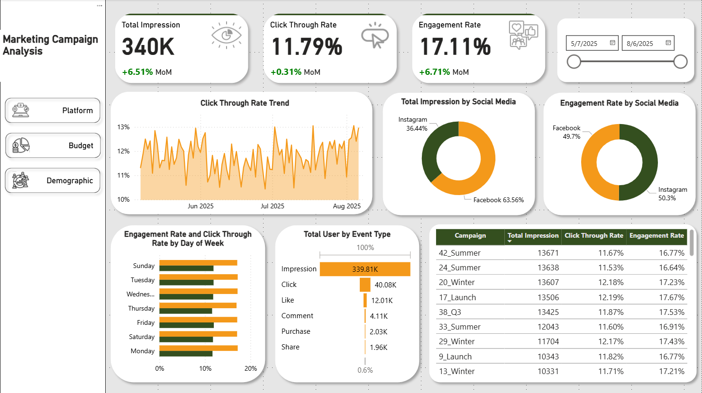
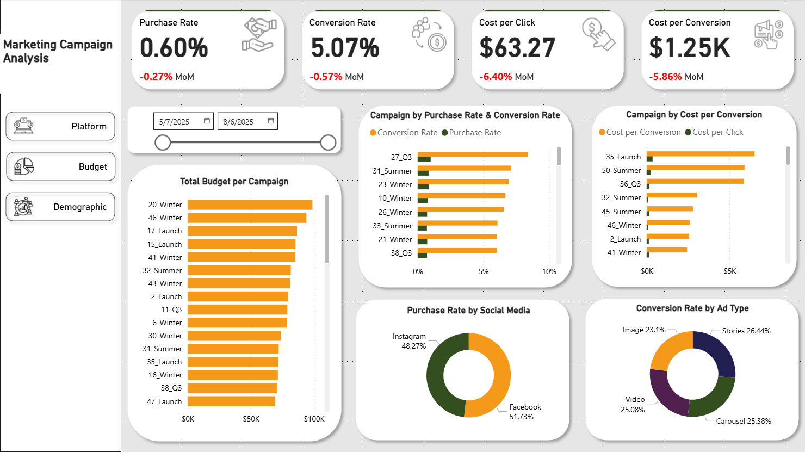
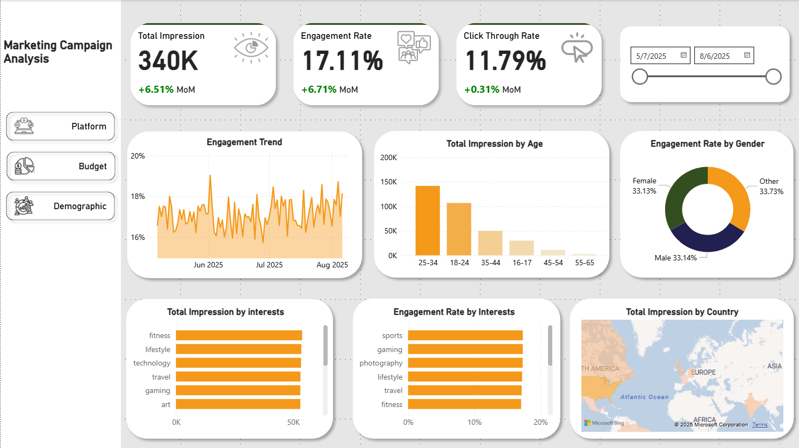

# 📊 Marketing Campaign Analysis Dashboard
## 🧩 Project Overview

This project analyzes the performance, budget efficiency, and demographic insights of multiple marketing campaigns across social media platforms (Facebook and Instagram). The dashboard was built using Power BI to transform raw campaign data into actionable insights for optimizing digital marketing strategies and budget allocation.

## 🎯 Objectives

Analyze social media campaign performance based on engagement, conversion, and reach.

Evaluate marketing budget efficiency across campaigns and ad types.

Understand audience demographics (age, country, and interest) to identify the most responsive market segments.

## 📈 Metrics Used
| Metric                        | Description                                                                                                             |
| ----------------------------- | ----------------------------------------------------------------------------------------------------------------------- |
| **Total Impression**          | Total number of times an ad was displayed to users.                                                                     |
| **Click Through Rate (CTR)**  | Percentage of users who clicked on the ad after viewing it. `CTR = Clicks / Impressions`                                |
| **Engagement Rate**           | Total likes, shares, and comments divided by impressions. `Engagement Rate = (Likes + Shares + Comments) / Impressions` |
| **Purchase Rate**             | Percentage of users who made a purchase after viewing the campaign. `Purchase Rate = Purchases / Impressions`           |
| **Conversion Rate**           | Percentage of users who purchased after clicking the campaign. `Conversion Rate = Purchases / Clicks`                   |
| **Cost per Click (CPC)**      | Average cost spent per user click. `CPC = Total Budget / Total Clicks`                                                  |
| **Cost per Conversion (CPA)** | Budget spent to acquire one purchase. `CPA = Total Budget / Total Purchases`                                            |

## ⚙️ Technical Implementation
### 📊 Tools and Techniques

- Power BI Desktop for data modeling, visualization, and insights reporting.

- DAX Functions:

    - CALCULATE() for conditional aggregations.

    - COUNTROWS() to calculate data occurrences.

    - DIVIDE() to create percentage-based metrics safely.

    - SWITCH() to categorize campaign or platform types.

- Model View: Established One-to-Many and Many-to-Many relationships between datasets (Campaigns, Ads, Events, Users) for accurate aggregation and filtering.

- Slicer: Added time-based slicers (month/quarter) for dynamic trend analysis and performance optimization.

### 📊 Dashboard Sections
**1. Campaign Performance Analysis**

- Visualizes total impressions, CTR, engagement rate, and conversion trends over time.

- Compares performance between Facebook and Instagram.

- Helps identify top-performing campaigns and ad types (video, carousel, stories).

**2. Budget Efficiency Analysis**

- Evaluates campaign spending efficiency using CPC and CPA.

- Identifies campaigns with high budget but low conversion (inefficient) and low budget but high conversion (efficient).

- Supports reallocation of marketing budgets toward high-performing ads.

**3. Demographic & Market Insights**

- Shows audience distribution by age, interest, and country.

- Reveals which demographic groups and interests yield the highest engagement and impressions.

- Guides targeting strategy for future campaigns.

## 💡 Key Insights & Business Recommendations

**- Overall Performance:**

- Total impressions reached 340K with a CTR of 11.79% and engagement rate of 17.11%, showing improvement from the previous month.

**- Platform Analysis:**

- Facebook contributed 63.56% of impressions, while Instagram generated higher engagement (50% vs 49%).

- Purchase rate was highest on Facebook (0.51%).

**- Campaign Insights:**

- Campaign “20_Winter” had the highest budget (90K dollar) but low performance (conversion rate 4.4%, purchase rate 0.54%).

- Campaign “27_Q3” had the lowest budget (12K dollar) yet achieved the best performance (conversion rate 8.4%, purchase rate 0.99%) with the lowest CPA (393 dollar) and CPC (33 dollar).

**- Ad Type Performance:**

- Stories (26%), Carousel (25.38%), and Video (25.08%) had the highest conversion rates.

**- Demographics:**

- Most impressions came from users aged 25–34, followed by 18–24.

- Top interests: Fitness, Lifestyle, and Technology.

- Highest impressions by country: United States (103K), Canada (34K), India (32K).

- Lowest impressions: Mexico, Brazil, and Australia.

**- Budget Efficiency:**

- Campaigns with smaller budgets sometimes delivered better conversion efficiency → potential to reallocate budget toward high-performing campaigns.

## 🚀 Business Impact

This dashboard helps marketing teams:

- Identify which platforms and campaigns deliver the highest ROI.

- Optimize ad spend by shifting budgets from low-performing campaigns to high-efficiency ones.

- Understand audience behavior and demographics for better targeting in future campaigns.
