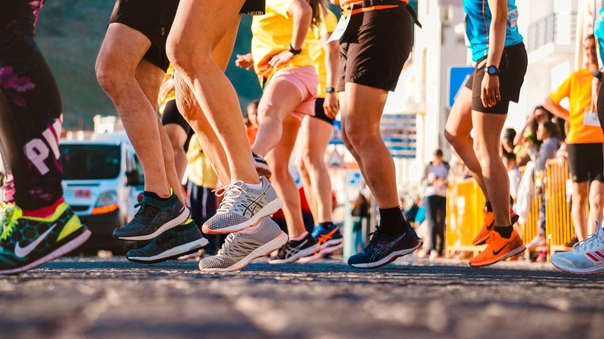
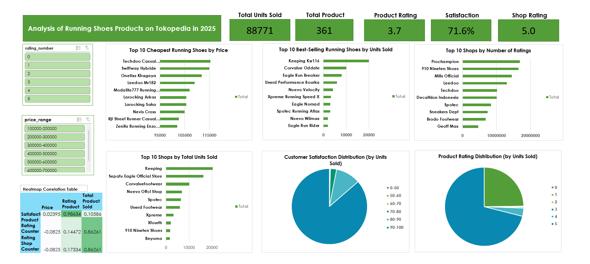

# Running Shoes Products Analysis on Tokopedia 2025 

## Latar Belakang Masalah
Akhir akhir ini, olahraga lari semakin populer di kalangan masyarakat. Namun, untuk mendukung hobi ini diperlukan sepatu lari yang nyaman dan berkualitas. Tantangan muncul ketika banyak sepatu lari dengan harga murah ternyata memiliki fitur terbatas atau kualitas yang diragukan.

Oleh karena itu, saya melakukan analisis terhadap produk sepatu lari di Tokopedia dengan tujuan untuk menemukan sepatu lari murah yang memiliki kualitas terbaik, berdasarkan data penjualan dan tingkat kepuasan pelanggan.

## Tujuan 
- Mengidentifikasi sepatu lari yang memiliki penjualan tertinggi 
- Mengukur kepuasan pembeli 
- Menentukan sepatu lari terbaik dengan harga murah dan dengan kepuasan pembeli yang tinggi

## Dataset 
Untuk melakukan analisis sepatu lari, data dikumpulkan melalui proses web scraping menggunakan Selenium pada platform Tokopedia. Pemilihan data difokuskan pada rentang harga Rp100.000 – Rp600.000, dengan asumsi bahwa kisaran harga tersebut mewakili segmen produk yang masih terjangkau namun tetap relevan dengan kualitas yang diharapkan konsumen.

Dataset yang diperoleh mencakup 583 baris data. Setiap baris data merepresentasikan informasi produk sepatu lari yang mencakup variabel-variabel berikut:

Nama Produk – Merek sepatu lari yang ditawarkan.

Harga Produk – Harga jual dalam rupiah.

Rating Produk – Nilai rating (1–5) yang diberikan oleh pelanggan.

Jumlah Rating Produk – Total pelanggan yang memberikan penilaian.

Total Review Produk – Jumlah ulasan yang diberikan secara tertulis oleh konsumen.

Jumlah Produk Terjual – Total unit yang berhasil terjual berdasarkan catatan Tokopedia.

Tingkat Kepuasan – Persentase kepuasan pelanggan berdasarkan rating.

Nama Toko – Penjual yang menawarkan produk tersebut.

Rating Toko – Nilai rata-rata kepuasan terhadap toko.

Jumlah Rating Toko – Total pengguna yang menilai toko tersebut.

## Data Cleaning 
Data hasil scraping perlu dibersihkan agar kualitas data baik untuk dilakukan analisis lebih lanjut. Pembersihan data dilakukan pada Excel dengan menggunakan beberapa formula Excel seperti LEFT(), RIGHT(), IF(), SUBTITUTE(), VLOOKUP(). Tahapan pembersihan dilakukan seperti, 
- Menghapus data yang duplikat 
- Mengubah tipe data yang sesuai 
- Menangani data yang kosong seperti kolom rating atau review
- Menambahkan variabel variabel yang sesuai seperti rentang harga, rentang tingkat kepuasan

## Analisa dan Hasilnya
Analisis dilakukan menggunakan SQL untuk pengolahan data awal dan Excel untuk pembuatan pivot table serta visualisasi dashboard. Beberapa hal yang dianalisis antara lain:  
**1. Total Produk & Penjualan**
- total sepatu lari yang terjual dari range harga 100.000-600.000 sebanyak 88771 sepatu dan banyak sepatu yang dijual sebesar 361 sepatu yang menandakan bahwasannya banyaknya peminat sepatu lari di rentang harga tersebut.

**2. Tingkat Kepuasan Pelanggan**
- Tingkat kepuasan pelanggan secara rata rata sebesar 71.6% dan rata rata rating sepatu sebesar 3,7% yang menguatkan asumsi saya bahwasannya pencarian sepatu dengan rentang harga tersebut tricky dan harus selektif dalam pemilihan produk

**3. Rata-Rata Rating Toko**
- Rata-rata rating toko mencapai 5, menunjukkan bahwa kepercayaan toko yang menjual produk dengan rentang harga Rp100000-Rp600000 cukup tinggi

**4. Produk Termurah**
-  Harga produk yang termurah seharga Rp101950 dengan merek Zeniffa Running Enzo diikuti dengan sepatu lainnya seperti Rjt Street Runner Casual Shoes** seharga Rp102659 dan Nevis Cross seharga 104900. 

**5. Produk Terlaris**
- Produk yang terlaris dengan merek Keeping Ksr116 dengan total sepatu yang terjual sebesar 20000 diikuti dengan sepatu merek Corvalue Oddate sebanyak 10040, Eagle Run Breaker sebanyak 8000.
- Produk populer lainnya dengan rating 5 yang terbagi dalam rentang harga:

    - Rp100k–200k: Keeping Ksr116, Corvalue Oddate, Nuevo Velocity

    - Rp200k–300k: Eagle Run Breaker, Eagle Nomad, Eagle Run Rider

    - Rp300k–400k: Spotec Atlas, Beyoma 200Mx, Spotec Easton, Unerd Bourka, 910 Nineten Haze Infiknit, 910 Nineten Geist Ekiden

    - Rp500k–600k: 910 Nineten Kanzaki, Ortuseight Berlin, Ortuseight Hyperblast Encore

    - Rp600k–700k: Ortuseight Hyperdrive, Brodo Venturi Coral, 910 Nineten Haze Tempo

**6. Toko dengan Penjualan Tertinggi**
- Keeping sebanyak 20.435 unit, Eagle Official Store sebanyak 16.250 unit, dan Corvalue Footwear sebanyak 10.071 unit mendominasi penjualan.

**7. Toko dengan rating tertinggi**
- Toko populer dengan rating tinggi: Prochampion, 910 Nineten Shoes, Mills Official, Decathlon Indonesia, Spotec, Sneakers Dept, Brodo Footwear, Geoff Max.

**8. Distribusi Kepuasan Pelanggan**
- Mayoritas penjualan (86,37%) berasal dari produk dengan tingkat kepuasan 90–100%.

**9. Distribusi Rating Produk**
- Produk dengan rating 5/5 menyumbang 71,06% dari penjualan.
- Rating “0” (24,8%) kemungkinan berasal dari konsumen yang tidak memberikan penilaian.

**10. Korelasi Antar Variabel**
- korelasi antara rating produk dan tingkat kepuasan (0.98) yang menunjukkan tingginya kepuasan maka rating produk tinggi juga
- korelasi antara total produk terjual dengan rating toko (0.86), yang menunjukkan reputasi toko berpengaruh signifikan terhadap volume penjualan 

## Dashboard

## Kesimpulan 

- Sepatu lari di rentang harga Rp100.000–Rp600.000 memiliki permintaan tinggi dengan total penjualan 88 ribu unit.

- Tingkat kepuasan relatif baik, dengan korelasi kuat antara rating produk dan kepuasan pelanggan.

- Penjualan terbesar dari merek Keeping, Eagle, dan Corvalue, sementara toko dengan reputasi baik cenderung lebih sukses menjual produk.

- Produk murah tersedia, namun kualitas bervariasi. Pembeli perlu memperhatikan rating produk dan rating toko untuk meminimalkan risiko.

## Rekomendasi

Berdasarkan kombinasi harga, kepuasan, rating produk, dan reputasi toko, sepatu yang direkomendasikan untuk dibeli:

- Keeping Ksr116, terlaris dengan penjualan tinggi, harga ekonomis, rating konsisten.

- Corvalue Oddate, populer di kelas entry-level, cocok untuk pembeli dengan budget rendah.

- Eagle Run Breaker, berada di segmen menengah dengan penjualan tinggi dan brand lokal yang terpercaya.

- Spotec Atlas & Unerd Bourka, di rentang Rp300k–400k, memiliki rating 5 dan kepuasan tinggi.

- 910 Nineten Kanzaki 1.0 & Ortuseight Berlin, untuk pembeli yang ingin kualitas lebih premium namun masih di bawah Rp600k.

Dengan mempertimbangkan korelasi kuat antara rating produk dan kepuasan (0,98) serta shop rating dan penjualan (0,86), sepatu yang berasal dari toko bereputasi tinggi dengan rating produk ≥ 4,5 lebih layak direkomendasikan.