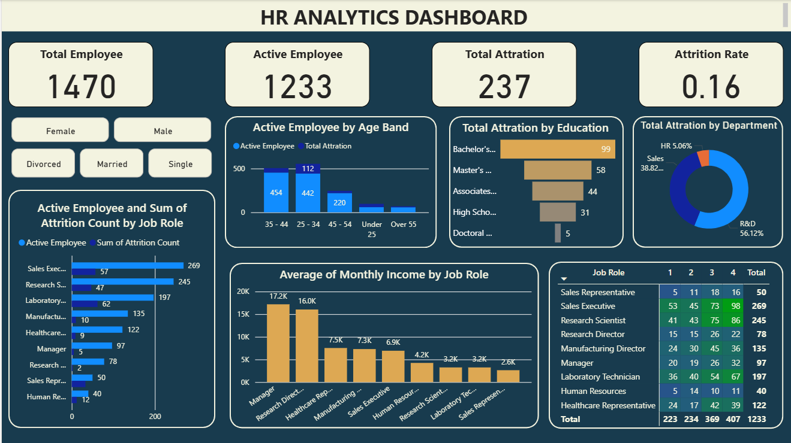

# HR Analytics using SQL and PowerBI

## Deskripsi
Proyek ini menganalisis data HR untuk mendapatkan wawasan terkait jumlah karyawan, attrition (pengunduran diri), distribusi karyawan aktif, dan pendapatan berdasarkan berbagai kategori seperti Job Role, Age Band, Education, dan Department. Hasil analisisi ditujukan pada HR Department atau CEO agar dapat membantu dalam mengidentifikasi risiko pengunduran diri yang tinggi, efisiensi rekrutmen, mengoptimasi budget gaji, dan membantu dalam pengambilan keputusan.

## Insights Potensial
- Attrition Rate dapat digunakan untuk mengevaluasi tingkat retensi karyawan.
- Distribusi berdasarkan Job Role dan Age Band membantu fokus rekrutmen dan retensi pada area dengan attrition tinggi.
- Analisis Job Satisfaction dapat menjadi indikator potensi pengunduran diri.
- Perbandingan Average Monthly Income antar role dapat memunculkan pertanyaan terkait kompensasi yang kompetitif.

## Permasalahan yang akan dijawab
1. Berapa total karyawan yang dimiliki perusahaan, baik aktif maupun non-aktif?

2. Berapa banyak karyawan aktif saat ini?

3. Berapa jumlah karyawan yang keluar (attrition) dan berapa persentase attrition rate?

4. Job Role mana yang memiliki karyawan aktif terbanyak dan tingkat attrition tertinggi?

5. Kelompok usia (Age Band) mana yang memiliki karyawan aktif terbanyak dan tingkat keluar tertinggi?

6. Berapa rata-rata pendapatan bulanan (Average Monthly Income) di setiap Job Role?

7. Tingkat pendidikan mana yang memiliki attrition tertinggi?

8. Department mana yang memiliki persentase kontribusi terbesar terhadap total attrition?

9. Bagaimana distribusi kepuasan kerja (Job Satisfaction) per Job Role untuk karyawan aktif?

10. Apakah terdapat indikasi hubungan antara gaji rata-rata, kepuasan kerja, dan tingkat attrition?

## SQL yang digunakan
- Aggregate Functions → SUM(), AVG(), COUNT(), ROUND()

- Conditional Aggregation → CASE WHEN ... THEN ... ELSE ... END

- Common Table Expressions (CTE) → WITH ... AS untuk perhitungan sementara

- JOIN → Menggabungkan hasil antar CTE

- Pivot Table → Menggunakan SUM(CASE WHEN ...)

- String Formatting → CONCAT() untuk membuat persentase dengan %

## Visualisasi Analisa di PowerBI
Hasil analisis SQL ini divisualisasikan menggunakan Power BI untuk memberikan dashboard interaktif yang memudahkan eksplorasi data. Berikut dashboard hasil visualisasi.

